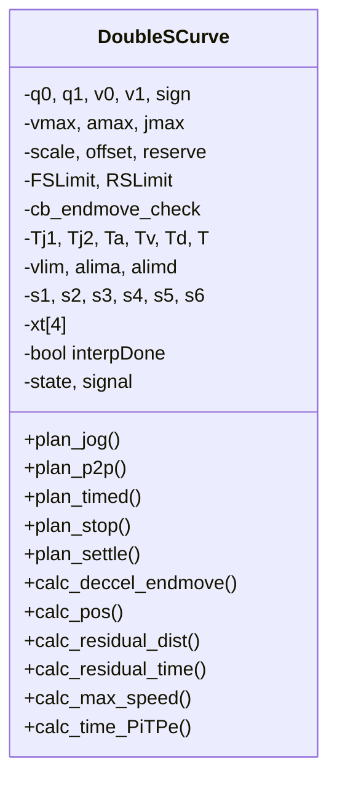
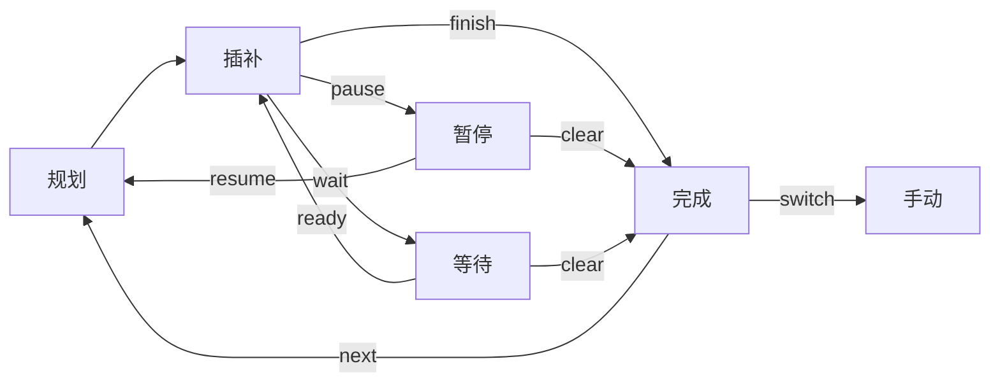
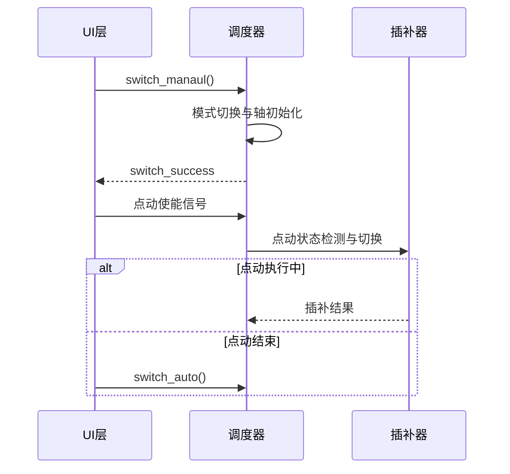

## Interpolation
该模块是一个机械臂运动插值模块，接收基础运动轨迹指令，输出离散的关节插补点。该模块仅负责提供在给定周期内能严格完成的插补计算接口，每个插补周期执行一次插补操作就可以得到当前周期内机器人各关节的目标位置，实时性需要下游程序和操作系统保证。

### 数据结构管理
`Interpolation` 模块共有四部分：
1. `InterpCurve`：基本运动曲线规划，如双S曲线。
1. `InterpSegment`：
1. `InterpDispatch`：调度器
1. `InterpSegmentBuffer`：指令缓存

对外接口只有调度器和不带处理信息的指令队列。



### 插补流程
整个插补流程分为三层：用户输入层、调度层、插补层。用户层将运动指令预处理后存入缓冲队列；调度层管理插补状态；插补层执行插补计算并输出离散点。

调度器管理一个状态机，在每个插补周期中根据当前状态调用插补算法。

#### 自动模式
自动模式下调度器状共五个：完成、规划、插补、等待、暂停，保存在 `DispatcherState::interpState`中，流程如下图所示。



插补过程中根据信号量进行状态切换，部分信号仅由算法内部激活，部分信号还可以由外部激活。
每条轨迹第一次插补前将会进行一次规划操作，通过前瞻回溯和其他速度规划算法计算该轨迹的速度曲线。
接收暂停信号后会在插补前缓存当前插补状态，重新规划暂停运动的速度曲线，再按新的速度曲线继续插补，直至停止。
一条轨迹插补完成后，将从缓存队列中取出下一条轨迹，重新进行规划和插补。

#### 手动模式


模式切换与轴初始化：切换到指定的手动模式，如关节、世界、工具、工件坐标系；更新各轴插补曲线的起点位置、速度、加速度等。

#### 关节运动
关节运动插补流程如下图所示。

预处理阶段主要处理点位格式转换，将起点终点点位转换为关节角，然后将当前段后平滑置零，再根据前段轨迹平滑指令同步修改前段后平滑和当前段前平滑。
规划阶段作用在第一次插补前，负责将前一段轨迹的速度曲线保存，并将未插补完成的部分平移到时间起点；规划并同步当前段所有轴的插补曲线；计算去除后平滑的实际插补时长`Tk`，并将插补计时器清零。
插补阶段计算从0时刻到`Tk`时刻前段与当前段的叠加关节角。

#### 空间运动
空间运动的插补流程如下图所示。


相邻两段笛卡尔曲线规划和插补时序如下图所示，仅展示前后平滑均存在的情况，`moveS`为合并插补距离。
1. 预处理阶段需要计算过渡段的控制点位置。`end/u=0`为上一段轨迹后平滑起点；`beg/u=1`为当前段轨迹前平滑终点。`u=0.5`为过渡段的中点，将过渡段长度分到两段轨迹；`mainD`为轨迹中不包含过渡曲线的主位移起点。
1. 规划阶段考虑前段规划中不足一个周期的部分，即`done`到`u=0.5`，以保证相邻规划的速度连续。实际规划从`done`开始，到后平滑曲线`u=0.5`结束。
1. 插补阶段第一次插补超过后`end`时，保存当前轨迹插补到的过渡段位置`doneU`，下一段轨迹开始规划，将当前时间设为`t=0`。插补到`done`位置后，前一段轨迹真正结束，不再输出插补距离增量到`moveS`。
```C++
   u=0  t=0            u=0.5     moveS     u=1
    |    |   pre.plan ->|         |         |    |-> cur.mainD
    |    |              |         V         |    |
----|----|---------|----|--------------|----|----|------------>
    |    |         |    |              |    |
   end   |       done                  |   beg
     pre.doneU     |-> cur.plan   cur.curMoveS
```
