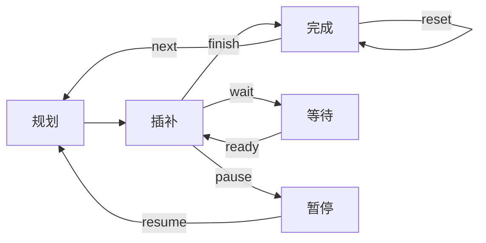

## Interpolation
该模块是一个机械臂运动插值模块，接收基础运动轨迹指令，输出离散的关节插补点。该模块仅负责提供在给定周期内能严格完成的插补计算接口，每个插补周期执行一次插补操作就可以得到当前周期内机器人各关节的目标位置，实时性需要下游程序和操作系统保证。

### 插补流程
整个插补流程分为三层：用户输入层、调度层、插补层。用户层将运动指令预处理后存入缓冲队列；调度层管理插补状态；插补层执行插补计算并输出离散点。

调度器管理一个状态机，在每个插补周期中根据当前状态调用插补算法。调度器状共五个：完成、规划、插补、等待、暂停，保存在 `DispatcherState::interpState`中。调度流程如下图所示。

插补过程中根据信号量进行状态切换，部分信号仅由算法内部激活，部分信号还可以由外部激活。
每条轨迹第一次插补前将会进行一次规划操作，通过前瞻回溯和其他速度规划算法计算该轨迹的速度曲线。
接收暂停信号后会在插补前缓存当前插补状态，重新规划暂停运动的速度曲线，再按新的速度曲线继续插补，直至停止。
一条轨迹插补完成后，将从缓存队列中取出下一条轨迹，重新进行规划和插补。
