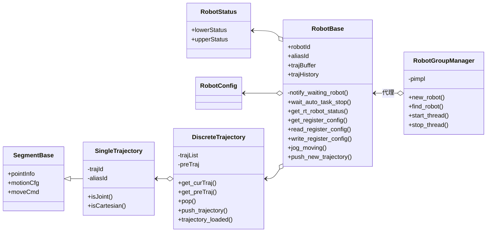
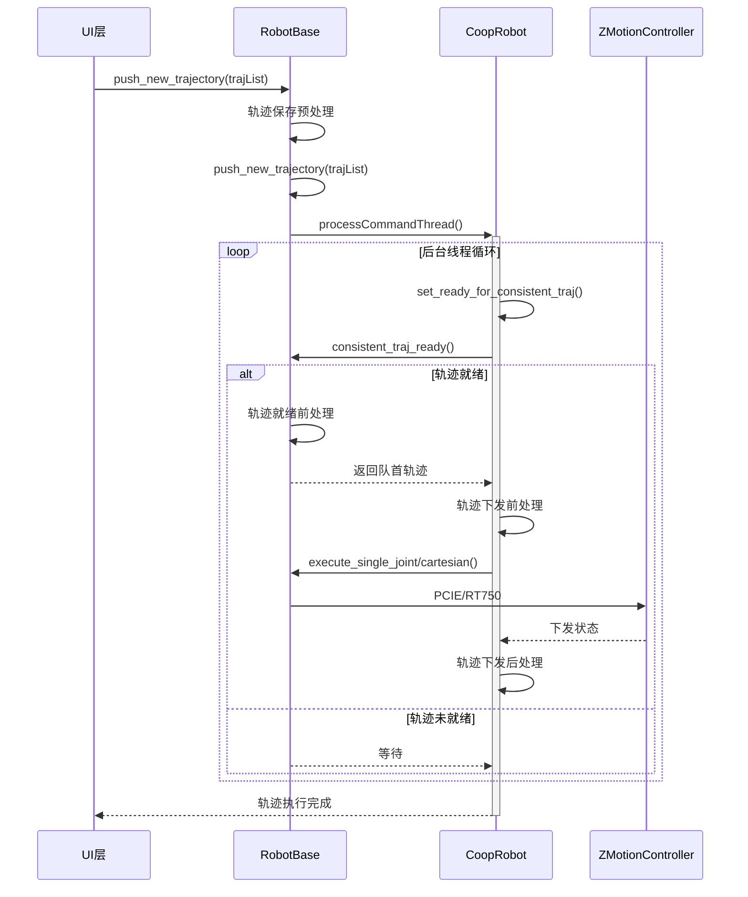
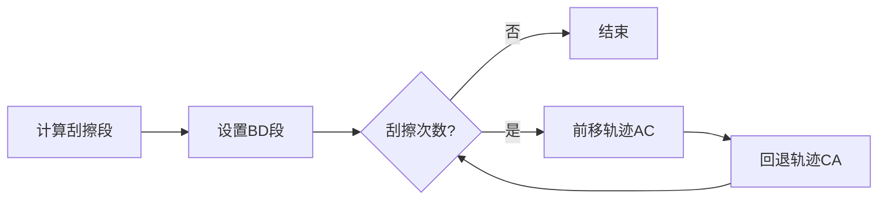

## RobotInterface
这是一个管理多机任务下发和状态维护的项目，旨在为上位机软件提供不同控制算法的统一接口，同时为了各种新需求添加了其他辅助功能。该项目的主要特点如下:

1. 适配不同运控算法，如正运动 SP 算法、正运动 RV 算法、飞秒自研算法、飞秒自研仿真器算法。
1. 指令参数完整。可以配置起息弧、摆动、跟踪、协同、自定义运动等参数。
1. 下发流程无阻塞，指令就绪立即下发，执行过程中也可以同时下发新任务。
1. 特殊轨迹处理，按需修改与原始指令运动不同的轨迹，如刮擦起弧、弧坑回填等。

该模块中的几个核心类如下之间的关系如下图所示：


### 系统状态管理
系统状态分为内部管理状态和对外开放的状态。内部管理状态主要是机器人管理类 `RobotGroupManager` 的状态标志集合；对外开放的状态可分为轮询状态、可查询状态、实时缓冲状态。轮询状态主要是机器人位置、运行异常等下位机状态信息，按 50ms 间隔更新；可查询状态目前使用统一刷新的方式，后续若可查询状态持续增多或部分状态延时不可控，则可以考虑单独开放查询接口。实时缓冲状态是下位机高频率持续缓存的状态数据，如视觉伺服、实时状态曲线绘制时需要使用，相邻数据间隔 2ms，更新间隔 20ms。

#### 轮询状态
更多轮询状态见 `RobotStatus`。

| 状态名 | 意义 | 类型 |
|---|---|---|
|`lowerStatus`| 下位机状态码 | `int` |
|`upperStatus`| 上位机状态码 | `int` |

上位机状态更新流程涉及到状态刷新、指令下发两个后台线程和上位机接口调用。

### 轨迹下发流程
轨迹下发流程通用流程如下图所示。对于不同的轨迹和不同的运控算法，在各个处理阶段会需要进行不同的操作，具体将在后文中分别介绍。



轨迹保存预处理：将上位机统一的轨迹数据转换为不同算法的轨迹数据格式，也可以在这里将部分轨迹配置写入到轨迹指令中。
轨迹就绪前处理：轨迹就绪后在这里调整轨迹，后续流程只处理下发，不再修改轨迹。
轨迹下发前处理：等待下位机接收指令就绪，包括缓冲充足、协同就绪绪等。
轨迹下发后处理：轨迹指令下发后通知下位机解析指令等操作。

#### 弧坑回填
弧坑回填定义为：息弧后使用回填工艺往轨迹反方向回退指定距离。在轨迹就绪前处理阶段需要额外操作。

轨迹就绪前处理：有息弧动作且回填使能时，根据回填工艺添加回填轨迹，随后取消原始轨迹的息弧动作。新增的回填轨迹 `taskId` 设为2，原始轨迹在新增回填轨迹后取消回填使能标志位，防止遍历轨迹时重复处理。

#### 刮擦起弧
刮擦起弧定义为：正常轨迹在起弧点第一次起弧和再起弧失败后，延轨迹方向空走前进一定距离，再延反方向回退的同时执行起弧动作，一次前进和回退共记作一次刮擦起弧。若起弧成功则停止回退，按焊接参数运动至原轨迹终点；若起弧失败，则重复空移前进和起弧回退动作，直至起弧成功，或刮擦起弧次数用完。下图表示第二次刮擦起弧成功后的轨迹。

```
A---B---C------D   A:起点, B:刮擦成功点, C:刮擦起点, D:终点
|------->          起弧等待，空走
<-------|          起弧
|------->          空走
   <----|          运动过程中起弧成功
   |----------->   焊接
```

刮擦动作不同于弧坑回填，下发完的运动可能需要中断并清空，再重新下发新运动，而不是单纯的增加轨迹和修改轨迹参数。在轨迹就绪前处理、轨迹下发前处理、轨迹下发后处理阶段需要额外操作。

轨迹就绪前处理：有起弧动作且刮擦使能时添加刮擦轨迹、起弧等待标识。


计算刮擦段：按轨迹方向前移指定距离，回退为起弧段，前进为空移段。第一段前进轨迹需要运动前起弧并等待，通过 `ScrubArc_Enable=3` 来区分回退时不需要等待的起弧动作；但需要保留其他的运动前动作。最后一条的回退起弧轨迹将 `waitArcOn` 置位，该轨迹下发完成后使能起弧等待标识符，下一条及后续的轨迹会等起弧成功后再下发；同时需要取消原本的起弧动作，保留运动后动作。刮擦过程中所有轨迹的 `taskId` 设为2，表示当前轨迹已经标记为刮擦轨迹，后续遍历时不重复处理。

轨迹下发前处理：起弧等待标志位置位时，进行起弧检测，起弧成功后取消等待起弧标志，允许后续轨迹下发。
轨迹下发后处理：若`waitArcOn`置位，则将起弧等待标志位置位。


#### 协同轨迹
todo: 默认的协同号规定，如协同号0表示沿用上一条轨迹的协同号。

### 轨迹参数
轨迹参数包含摆焊参数、焊接参数、再起弧参数、跟踪参数、弧坑回填参数、同步参数、缓冲动作参数。每种参数都提供了对应的序列化和反序列化函数，序列化后可以直接下发给控制卡，控制卡通过反序列化解析。目前为了减少接口调整，所有参数都序列化后保存在轨迹参数中，后续为了上位机接口规范化，可以取消序列化保存的方式，直接使用结构体存储，下发到控制卡之前再进行序列化操作。
